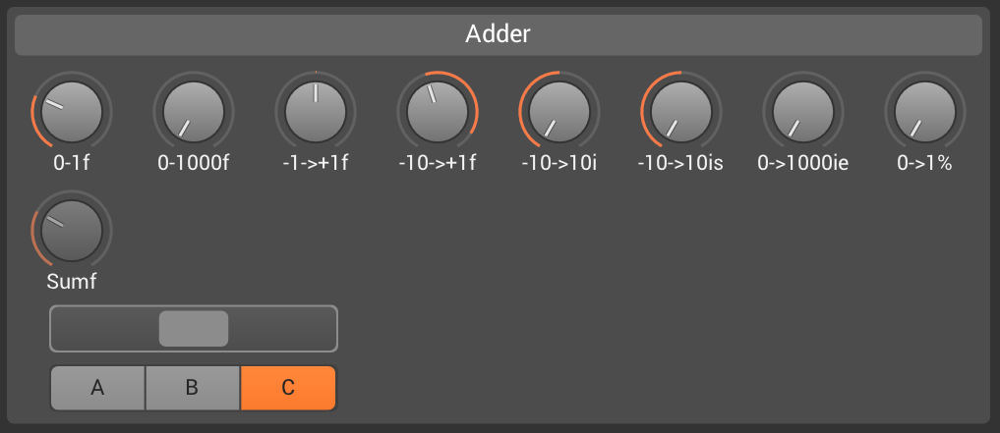

[NodeGraph](https://github.com/cmaughan/nodegraph) - A simple Directed Graph, with SVG UI
===================================================================================================

[](https://travis-ci.org/cmaughan/nodegraph)
[](https://ci.appveyor.com/project/cmaughan/nodegraph)
[](https://github.com/cmaughan/nodegraph/blob/master/LICENSE)
[](https://codecov.io/gh/cmaughan/nodegraph)

Nodegraph is a basic directed graph, used in my live coding project.  It is a work in progress.  The nodes in the graph are evaluated using a 'Pull' architecture, and support concepts of Flow and Control data.  The included sample application shows the node UI you can build from the graph specification. It supports non-linear rotary knobs of linear and non-linear type, buttons and sliders.  There is currently no way to build the graph visually, but you can generate visualizations of it and control input parameters.  This project should very much be considered a work in progress.  The intended use-case is a graph representing an audio synthesizer; you can find that project at [MAudio](https://github.com/cmaughan/MAudio).



Because of modern CMake, you can install this library & reference it in your CMake with just a couple of lines.

First, you need to build MUtils, my shared library of useful bits. Hop over to [MUtils](https://github.com/cmaughan/MUtils) and build and install the package.

The NodeGraph build is pretty standard
It is built using these helper scripts:

```
config.bat OR config.sh
build_all.bat OR build.sh
```

Now in your project CMakeLists.txt, you can add the following to reference the library and pull in all the header paths.  Note there are no include/library defines; the target_link_libraries is enough to pull all the necessary things in.  See the example application for how this works.

```
find_package(NodeGraph REQUIRED)
...
target_link_libraries(MyApp PRIVATE NodeGraph::NodeGraph)
```


